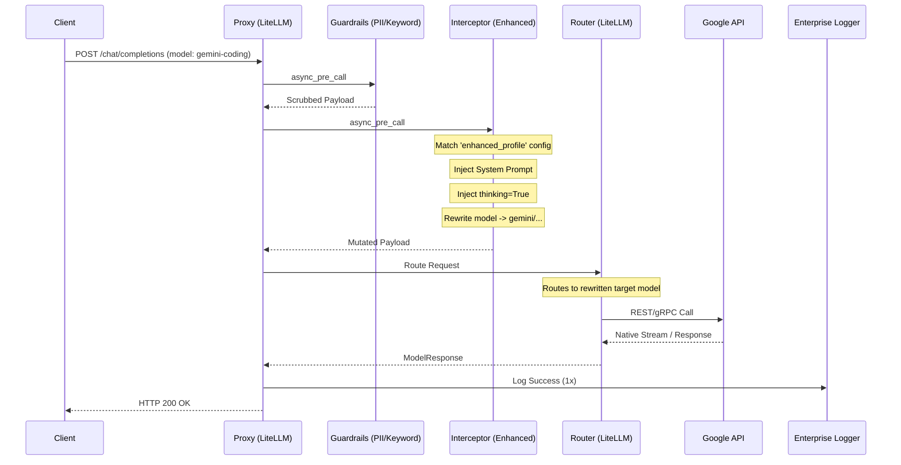

# Architecture Design Note: Enhanced Model Interceptor (Middleware)

**Date:** April 11, 2026  
**Status:** Superseded by implementation  
**Author:** Gemini CLI Architecture Agent  
**Context:** Airlock Proxy / Model Routing Ecosystem  

---

## 1. Executive Summary

This document outlines the architecture for introducing "enhanced" model profiles to the Airlock proxy, initially exposing a specialized `gemini-coding` model. The objective is to enable advanced model features—specifically Gemini 3.1 Pro's "thinking" capabilities and enforced system prompt controls—without disrupting standard proxy traffic.

Initial explorations considered building a custom LiteLLM provider (`CustomLLM`) to act as a delegator. This note originally rejected that approach in favor of a guardrail interceptor.

Actual implementation diverged. Airlock now uses `airlock/providers/enhanced_passthrough.py`, a custom provider that resolves `enhanced/*` aliases at execution time, forwards to the physical target model, marks the inner call `no_log=True`, and sets `metadata.airlock_skip_fathom_logger=True` so one logical request still produces one Airlock/Fathom log record. This note remains useful as design history, but it no longer describes the live code path.

### Current Behavior Snapshot

- Runtime implementation: [`airlock/providers/enhanced_passthrough.py`](<repo-root>/airlock/providers/enhanced_passthrough.py)
- Config surface: `model_list[].litellm_params.enhanced_profile`
- Forwarded fields: target model, injected system prompt, normalized Gemini reasoning params, provider auth (`api_key`), and transport context (`api_base`, `headers`, `client`)
- Logging behavior: inner forwarded provider call skips Airlock Fathom logging; one logical alias request produces one `RequestLog` row
- Verified live path: `gemini-coding` now reaches HTTP `200` against same physical target as `gemini-3.1-pro-tools`

---

## 2. Architectural Goals & Constraints

*   **Generic Abstraction Surface:** The system must support defining new enhanced models (e.g., `enhanced/claude-architect`, `enhanced/o1-researcher`) purely via configuration, without touching Python code.
*   **Zero "Swiss Cheese" Workarounds:** The architecture must not rely on internal metadata flags to bypass callbacks, skip logging, or handle recursive proxy loops. The request lifecycle must remain linear and standard.
*   **Non-Blocking Execution:** Payload mutation must occur asynchronously to preserve proxy throughput and TTFT (Time To First Token).
*   **Full Parity:** Enhanced requests must seamlessly flow through the existing 9-stage Guardrail chain, Enterprise Logging, and metrics subsystems exactly once.
*   **Out-of-Band Control:** The interceptor must be capable of silently injecting system prompts, overriding temperature, enabling reasoning modes, and enforcing tool-calling constraints.

---

## 3. The Interceptor Pattern (vs. CustomLLM Delegator)

### The Flaws of the Delegator (`CustomLLM`) Approach
A `CustomLLM` delegator intercepts a request and then internally calls `litellm.acompletion()` to forward it. This creates a "request within a request."
*   **The Re-entry Problem:** The inner call triggers all proxy callbacks and guardrails a second time, resulting in duplicate logs and doubled latency unless messy bypass flags are injected.
*   **Streaming Complexity:** Returning an `AsyncGenerator` from an inner call to the outer proxy layer is brittle and often breaks LiteLLM's internal token counting.
*   **Hardcoding:** Provider logic naturally trends toward bespoke `if model == 'X':` statements, degrading maintainability.

### The Elegance of the Interceptor (`CustomGuardrail`)
By implementing the enhancement logic as a `pre_call` Guardrail (Middleware), we operate on the request *before* LiteLLM routes it to the upstream provider.
1.  **Intercept:** Catch any request where the `model` matches a configured enhanced profile.
2.  **Mutate In-Flight:** Update `data["messages"]` and `data["optional_params"]` directly.
3.  **Rewrite Target:** Change the `model` string in the request payload to the actual physical upstream model (e.g., rewrite `enhanced/gemini-coding` to `gemini/gemini-3.1-pro-preview-customtools`).
4.  **Release:** Let the request continue down the standard LiteLLM pipeline.

There is no inner request, no double-logging, and streaming works natively because LiteLLM handles the actual upstream connection.

---

## 4. The Data-Driven Abstraction Surface (`config.yaml`)

To ensure the system is not bespoke, we define a structured schema within the `model_list` configuration. Enhanced models are declared as standard logical models, but they include an `enhanced_profile` block within their `litellm_params`.

```yaml
model_list:
  # --- Standard Model ---
  - model_name: gemini-3.1-pro
    litellm_params:
      model: gemini/gemini-3.1-pro-preview
      api_key: os.environ/GOOGLE_AISTUDIO_API_KEY

  # --- Enhanced Model Profile ---
  - model_name: gemini-coding
    litellm_params:
      # This is the logical name clients request
      model: enhanced/gemini-coding  
      
      # The interceptor looks for this block
      enhanced_profile:
        # The physical model to route to after mutation
        target_model: gemini/gemini-3.1-pro-preview-customtools
        
        # Injected at index 0 or appended to existing system prompt
        system_prompt: "CRITICAL: You are operating in a multi-turn tool-calling loop. You must retain and finalize all reasoning pathways. Do not truncate internal thoughts."
        
        # Overrides merged into the request payload
        params:
          thinking: true
          thinking_level: "MEDIUM"
          temperature: 0.2
```

This design allows an administrator to create dozens of specialized profiles—tailored for coding, creative writing, or strict JSON extraction—using different base models, entirely through YAML.

---

## 5. Detailed Component Design

### 5.1. `EnhancedModelInterceptor` Class
Located at `airlock/guardrails/enhanced_interceptor.py`, this class extends `litellm.integrations.custom_guardrail.CustomGuardrail`. It hooks into the `async_pre_call` stage.

```python
from litellm.integrations.custom_guardrail import CustomGuardrail

class EnhancedModelInterceptor(CustomGuardrail):
    async def async_pre_call(self, data: dict, **kwargs):
        """Intercepts the request, mutates the payload, and rewrites the model target."""
        # 1. Check if this request is targeting an enhanced model profile
        litellm_params = data.get("litellm_params", {})
        enhanced_profile = litellm_params.get("enhanced_profile")
        
        if not enhanced_profile:
            return data # Not an enhanced model, pass through unchanged

        # 2. Extract rules from the data-driven config
        target_model = enhanced_profile.get("target_model")
        system_prompt = enhanced_profile.get("system_prompt")
        params_override = enhanced_profile.get("params", {})

        if not target_model:
            raise ValueError(f"Enhanced profile for {data.get('model')} is missing 'target_model'")

        # 3. Mutate: System Prompt Injection
        if system_prompt:
            messages = data.get("messages", [])
            self._inject_or_append_system_prompt(messages, system_prompt)
            data["messages"] = messages

        # 4. Mutate: Parameter Overrides
        if params_override:
            # optional_params are what LiteLLM uses to build the provider payload
            optional_params = data.get("optional_params", {})
            optional_params.update(params_override)
            data["optional_params"] = optional_params

        # 5. Rewrite Target Model
        # By changing data["model"], LiteLLM will dynamically re-route the request 
        # to the physical provider configured for that model name.
        data["model"] = target_model

        return data
```

### 5.2. Execution Order within the Guardrail Chain
The Interceptor should run *after* PII and Keyword guards, but *before* semantic routing or MCP tool guards. This ensures that the interceptor operates on safe, redacted text, and that subsequent dynamic routing sees the rewritten target model.

In `config.yaml`:
1. `airlock-pii-guard`
2. `airlock-keyword-guard`
3. `airlock-enhanced-interceptor`  <-- New Middleware
4. `airlock-fast-guardian`

---

## 6. Data Flow Sequence



---

## 7. Implementation Plan

1.  **Create Middleware:** Implement `airlock/guardrails/enhanced_interceptor.py` containing the `EnhancedModelInterceptor` class.
2.  **Update Guardrail Registration:** Add the interceptor to the `guardrails` list in `config.yaml`.
3.  **Define Model Profiles:** Add the `gemini-coding` logical model to `config.yaml` utilizing the new `enhanced_profile` abstraction. Ensure the underlying target model (`gemini/gemini-3.1-pro-preview-customtools`) is also registered or implicitly supported.
4.  **Unit Tests:** Create `tests/test_enhanced_interceptor.py` to verify that:
    *   Requests without an `enhanced_profile` pass through unmodified.
    *   Requests with a profile have their system prompt injected correctly (handling both pre-existing system prompts and empty message arrays).
    *   Parameters are deeply merged into `optional_params`.
    *   The `model` string is correctly rewritten in the returned data payload.
